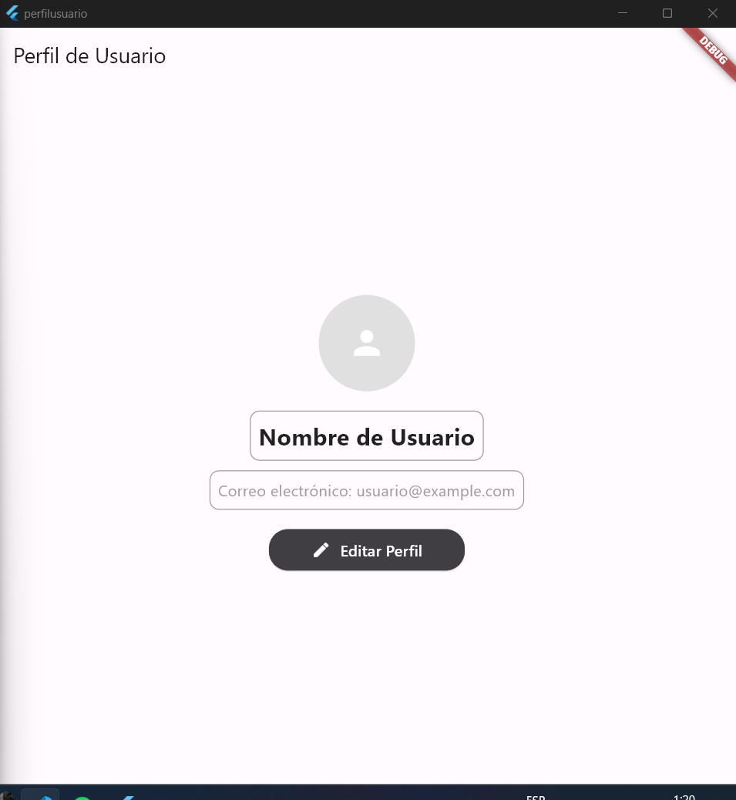
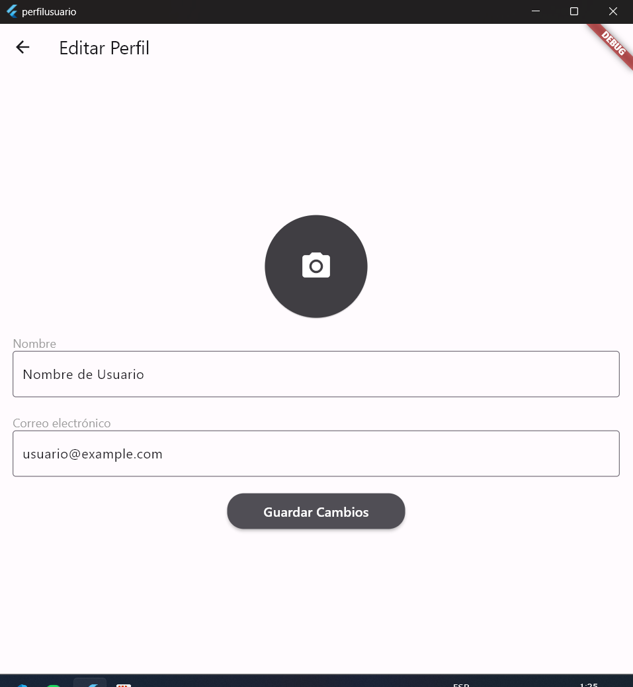
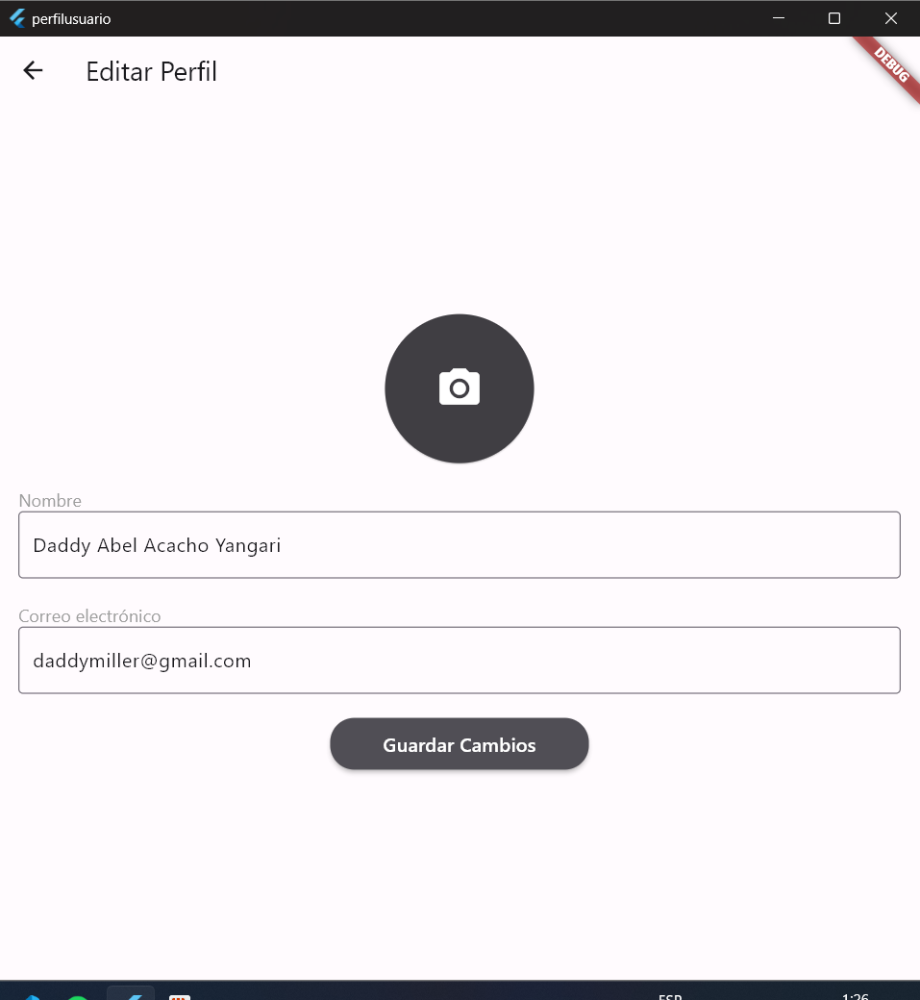
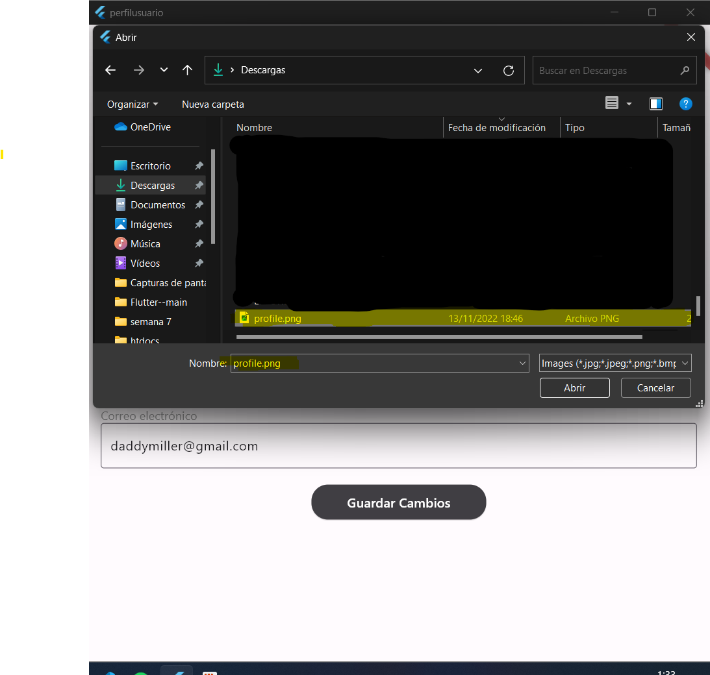
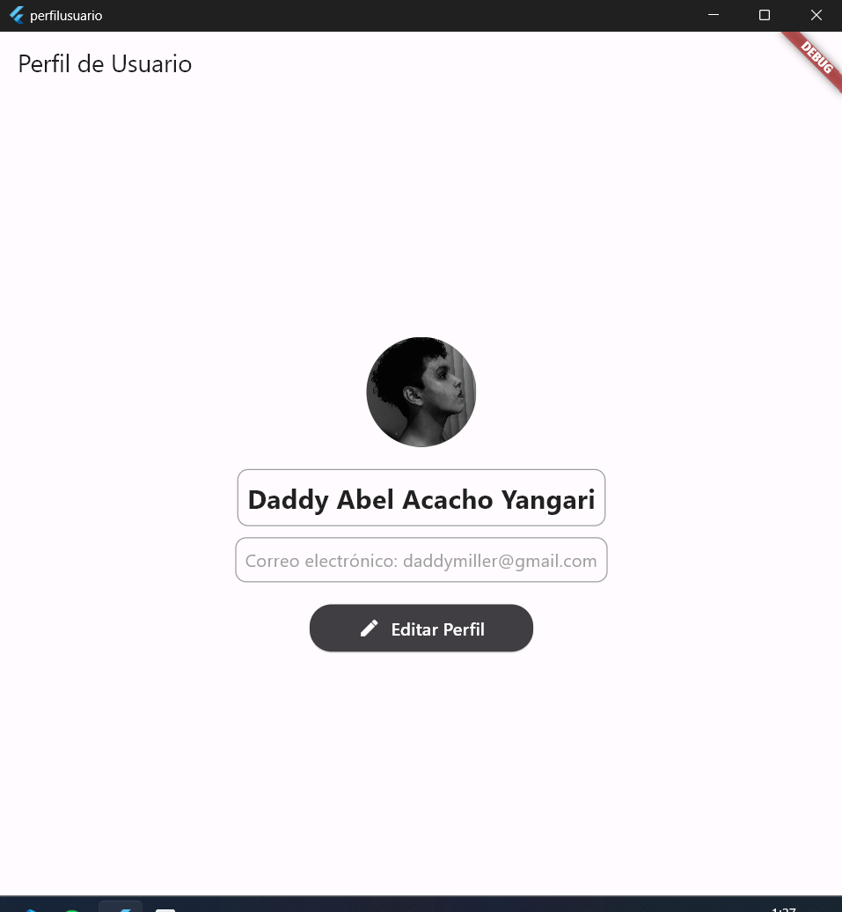

# Exploración del Contexto y Principios de Diseño en Flutter

## Objetivos de Aprendizaje:
   
 El objetivo principal de este proyecto es que los alumnos adquieran conocimientos y habilidades en el desarrollo de aplicaciones móviles utilizando el framework Flutter, a través de la creación de una pantalla de perfil de usuario
   
- Comprender el Contexto en la Jerarquía de Widgets de Flutte
- Identificar y Aplicar Principios de Diseño en Flutter
- Desarrollar Habilidades Prácticas en Flutter
- Aplicar Prácticas de Desarrollo de Calidad

## Parte 1: Investigación y Conceptualización

### Investigación del Contexto en Flutter:

El `BuildContext` es un objeto que proporciona información sobre la ubicación del widget en el árbol de widgets. Se utiliza para acceder a temas, estilos, realizar navegación y obtener referencias a otros widgets en la jerarquía.

Es fundamental porque permite la comunicación entre widgets y la interacción con el entorno. Por ejemplo, al utilizar `Navigator` para la navegación entre pantallas o al obtener información de un widget ancestro a través de `InheritedWidget`.

### Principios Esenciales de Diseño en Flutter

1. **Material o Cupertino**

- Material Design se basa en principios como "Material es la Metáfora", "Movimiento Deliberado" y "Diseño Adaptativo".

- Cupertino, por otro lado, sigue principios de simplicidad y claridad.

2. **Consistencia:** 

- La consistencia crea una experiencia familiar y predecible, facilitando la comprensión del usuario.

3. **Retroalimentación Directa:** 

- Proporciona respuestas inmediatas a las acciones del usuario, mejorando la usabilidad.

4. **Jerarquía Visual:** 

- Organiza los elementos de manera que la información más importante sea fácilmente accesible, mejorando la eficiencia.

5. **Animaciones Sutiles:**

   - Puede mejorar las experiencia del Usuario

   - Utilizar y facilitar las implemetación de animaciones fluidas y sutiles para hacer que la interfaz de usuario sea más actractiva y facil de entender.

**Creación de la Pantalla de Perfil de Usuario:**

Utilizar widgets como MediaQuery, Navigator o InheritedWidget para acceder al BuildContext según sea necesario.

Aplicar los principios de diseño seleccionados para garantizar una interfaz intuitiva y estéticamente agradable.
Responsividad:

## Parte 2: Desarrollo Práctico
### Creación de la Pantalla de Perfil de Usuario:

#### Uso de Widgets que Requieren

- Utilizar `MediaQuery` para obtener información sobre el tamaño de la pantalla.

- Utilizar `Navigator` para la navegación entre pantallas.

- Explorar `InheritedWidget` para compartir datos entre widgets.

### Responsividad:

Utilizar `Flexible`, `Expanded` y `LayoutBuilder` para adaptar el diseño a diferentes tamaños y orientaciones de pantalla.

### Capturas de Pantalla

1. **Foto de  Perfil Usuario**

2. **Foto Editar Perfil Usuario**

3. **Foto Editar Perfil Usuario Datos**

4. **Foto Editar Perfil Usuario Imagen**

5. **Foto Perfil Usuario Editado**

